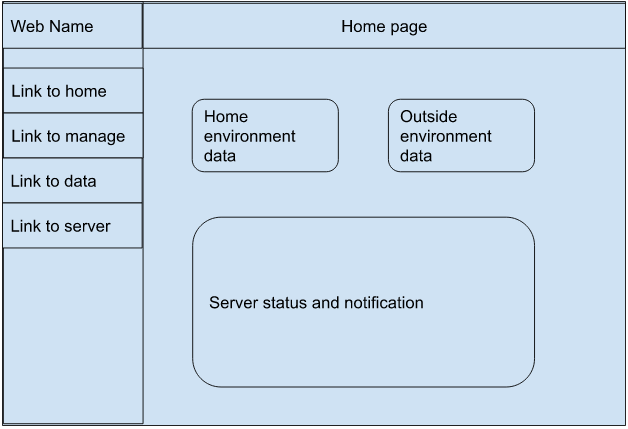
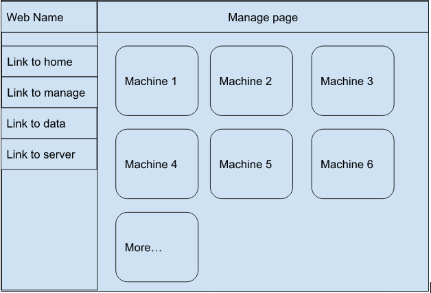
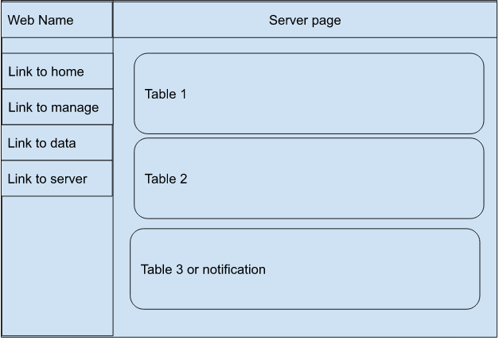
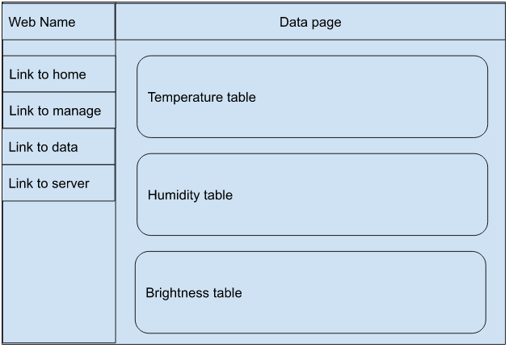

# CINF201 Final Project
- yunrui huang
- 02/28/2023

## Overall Theme
The main theme of this website would be my smart-home system user interface. Right now, I set up a smart-home system for my home, including collecting environment data(eg. temperature,  humidity, and brightness), and detecting server status (NAS server). So, the topic of this webpage is helping me to visualize the data and manage the system. That would be an important user interface for my smart-home system. And the audience would be me and anyone who would use this system.

## Content of Pages

This website would have four web pages right now, one home page and one manages page and two data visualization pages. All the webpages should contain a left sidebar to navigate to other pages, and a website name (such as "Smart-home") at the top left. And a title of what this page does at the top. The home page, would contain the home environment data right now and outside environment data right now (from weather.com). The manage page would contain which machine (use for collecting data) is online and which isn't, and it should able to navigate to visualize the data page of each machine. The data visualization page for the server should contain three tables that show the status of the server. The data visualization page for the environment should contain three tables to show the data (temperature,  humidity, and brightness) that the machine collected.

## Wireframe of Layout

### homepage

### manage page

### data page (for server)

### data page

 
