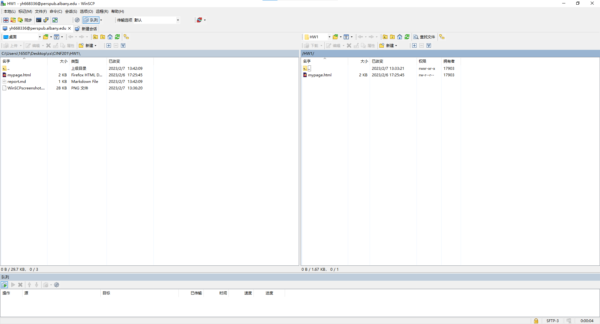
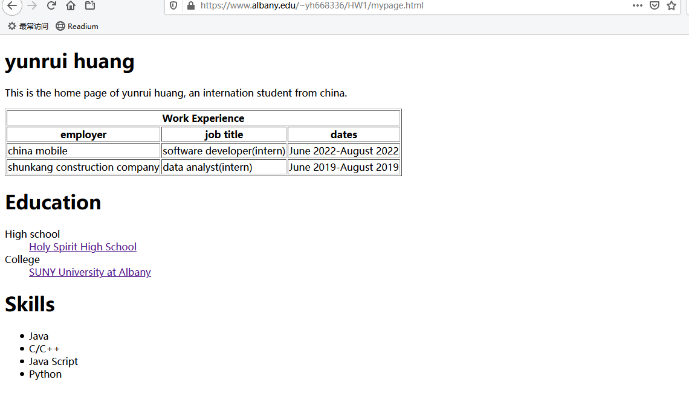

# CNIF 201 Assignment 1

- yunrui Huang
- 02/07/2023

-----

## web page link:
https://www.albany.edu/~yh668336/HW1/mypage.html

## WinSCP screenshot

## webpage screenshot

## Question

**QUESTON 1 : What does this intrapage link do after you add it and click it?**

It jump to the tag which has the same name as I put in the "herf" attribute. Such as herf="#top" will jump to the tag which name is "top"

**Question 2 : which type of list did you choose and why?**

I choose unordered list. Because the skills are parallel, which one at the first isn't matter, unordered list would be more reasonable than ordered list.